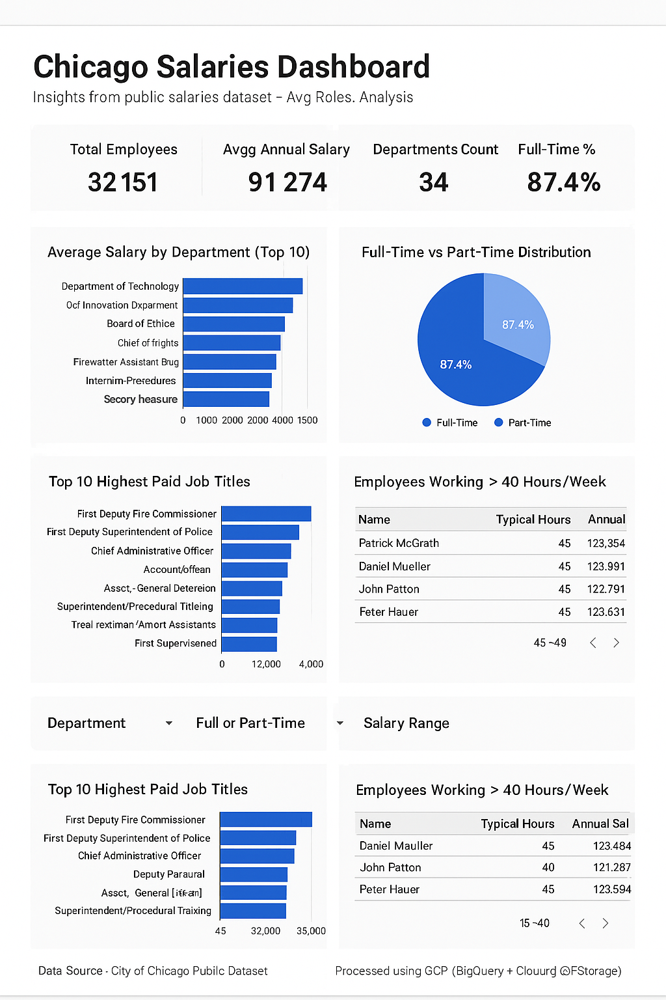

# GCP Chicago Salaries Optimization Project

A data engineering project leveraging Google Cloud Platform (GCP) to build an end-to-end data pipeline. The project utilizes public salary data from the City of Chicago to demonstrate data ingestion, storage, transformation, and optimization using SQL and Python.

## 📁 Dataset

- **Source**: [City of Chicago Salaries](https://data.cityofchicago.org/)
- **File**: `chicago_salaries.csv`
- **Rows**: 32,151+
- **Columns**: Name, Job Title, Department, Full/Part-Time, Salary/Hourly, Hours, Salary, Hourly Rate

---

## 🚀 Project Workflow

1. **Data Ingestion**
   - Python script to download and upload CSV to Google Cloud Storage (GCS)
2. **Load to BigQuery**
   - CLI command to load data from GCS to BigQuery
3. **SQL Data Transformation & Optimization**
   - Applied transformations and aggregated metrics using optimized SQL queries
4. **Scheduled Queries**
   - Created a scheduled query to run daily summary exports
5. **Export to GCS**
   - Exported the processed BigQuery table back to GCS

---

## 🔧 Technologies Used

- **Cloud**: Google Cloud Platform (GCS, BigQuery)
- **Language**: Python
- **SQL**: BigQuery Standard SQL
- **Visualization**: Looker Studio (Optional)
- **Tools**: Google Cloud CLI, Git, GitHub

---

## 📊 SQL Queries Used

- Average salary by department  
- Top 10 highest-paid job titles  
- Filter employees working > 40 hours/week  
- Convert hourly rates to annual salary  
- Full-time vs part-time employee count  

> All SQL scripts are available in [`sql_scripts`](./sql_scripts) folder

---

## 🐍 Python Scripts

- [`upload_to_gcs.py`](./python_scripts/upload_to_gcs.py): Uploads local CSV to GCS  
- [`load_to_bigquery.py`](./python_scripts/load_to_bigquery.py): Loads GCS CSV into BigQuery  
- [`export_from_bigquery.py`](./python_scripts/export_from_bigquery.py): Exports BigQuery table to GCS

---

## 📈 Optional Looker Studio Dashboard

> If used, attach a preview and link here

- [Live Dashboard (Optional)](https://lookerstudio.google.com/reporting/...)

---

## 📎 How to Reproduce

1. Clone this repo  
2. Update GCP bucket/table names in Python scripts  
3. Run the Python scripts step-by-step  
4. Use provided SQL queries for transformations  
5. Export and visualize

---

## 📬 Author

**Vijay More**  
Aspiring GCP Data Engineer  
📧 vijaymore300793@gmail.com  
🔗 [LinkedIn](https://www.linkedin.com/in/morevijay-dataengineer)

---

## ⭐️ Star this Repo

If you found this helpful, feel free to star ⭐ this repository and share it with your network.

